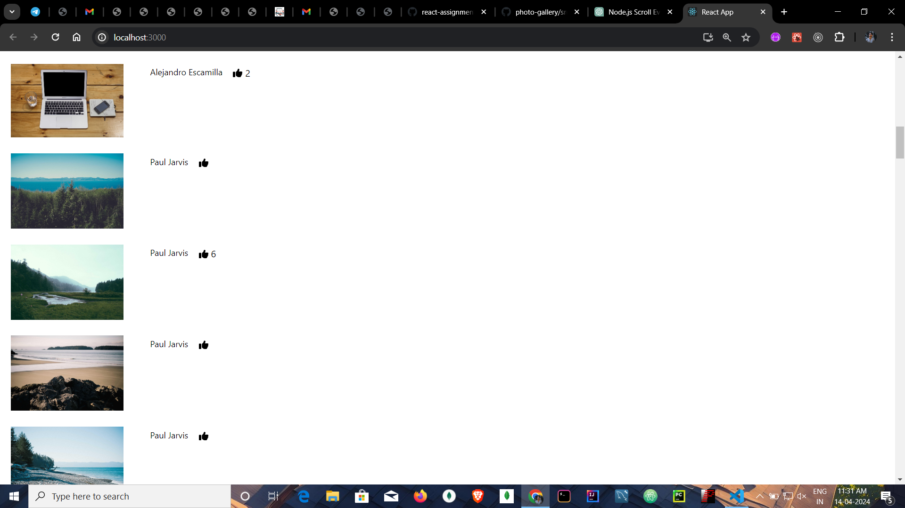

# Photo Gallery

Created a single page, Infinite scroll implementation based on paginated JSON feeds

## How it Works
* Intially the page will load data from the (https://picsum.photos/v2/list?page=1) and add it to the list.
* The Scroll Detection React Component utilizes the `useEffect` hook provided by React to add a scroll event listener to the window. 
* When the user scrolls, the component calculates the current scroll position, the height of the viewport, and the total height of the document.
* If the sum of the scroll position and the viewport height equals the total document height, it indicates that the user has scrolled to the bottom of the page.
* Then result for the next page using (https://picsum.photos/v2/list?page=2) this link will be added to the list.
* And this process repeats until no data exist at the end.

## Extra Features
* The loaded data will have the image, author name and the thumbs up button.
* By clicking thums up button it will increase the count which is set to be zero intially.

## Screenshot

# Getting Started with Create React App

This project was bootstrapped with [Create React App](https://github.com/facebook/create-react-app).
### `npm install`
Install all dependencies using the above command.

## Available Scripts

In the project directory, you can run:

### `npm start`

Runs the app in the development mode.\
Open [http://localhost:3000](http://localhost:3000) to view it in your browser.

The page will reload when you make changes.\
You may also see any lint errors in the console.

### `npm test`

Launches the test runner in the interactive watch mode.\
See the section about [running tests](https://facebook.github.io/create-react-app/docs/running-tests) for more information.

### `npm run build`

Builds the app for production to the `build` folder.\
It correctly bundles React in production mode and optimizes the build for the best performance.

The build is minified and the filenames include the hashes.\
Your app is ready to be deployed!

See the section about [deployment](https://facebook.github.io/create-react-app/docs/deployment) for more information.

### `npm run eject`

**Note: this is a one-way operation. Once you `eject`, you can't go back!**

If you aren't satisfied with the build tool and configuration choices, you can `eject` at any time. This command will remove the single build dependency from your project.

Instead, it will copy all the configuration files and the transitive dependencies (webpack, Babel, ESLint, etc) right into your project so you have full control over them. All of the commands except `eject` will still work, but they will point to the copied scripts so you can tweak them. At this point you're on your own.

You don't have to ever use `eject`. The curated feature set is suitable for small and middle deployments, and you shouldn't feel obligated to use this feature. However we understand that this tool wouldn't be useful if you couldn't customize it when you are ready for it.

